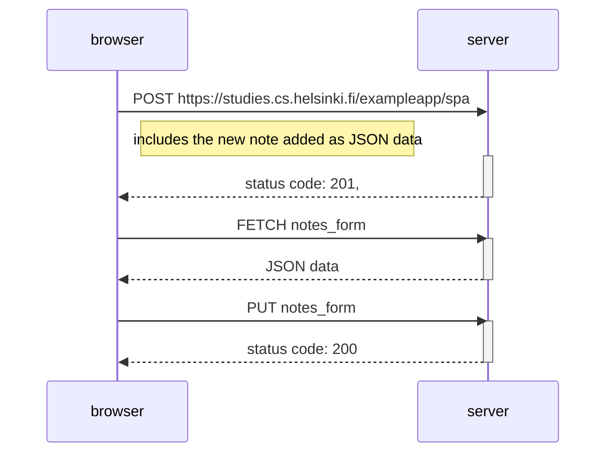

```mermaid
sequenceDiagram
    participant browser
    participant server

    browser->>server: POST https://studies.cs.helsinki.fi/exampleapp/spa
    Note right of browser: includes the new note added as JSON data
    activate server
    server-->>browser: status code: 201, 
    deactivate server

    browser->>server: FETCH notes_form
    activate server
    server-->>browser: JSON data
    deactivate server

    browser->>server: PUT notes_form
    activate server
    server-->>browser: status code: 200
    deactivate server

```

